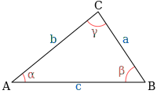

- 担当：山里敬也　（名古屋大学　教養教育院，工学研究科 情報・通信工学専攻）
- 日時：8 月 12 日（金）、13 日（土）　 10：30 ～ 12：00、13：00 ～ 14：30
- 講義場所：教育学部附属中・高等学校　交流ホール

---

このページでは高大接続探究セミナーの「Python でフラクタルを描画しよう」を希望する高校生の皆様に，事前に知っておいて欲しい内容について書きます．

また，参考までに昨年度の資料も公開します．

- [2021 年度 1 日目の資料](Turtle_Graphics_Day_One.pdf)

- [2021 年度 2 日目の資料](Turtle_Graphics_Day_Two.pdf)

2022 年度も昨年度と同じ内容で講義を行います．

以下に目次を示します．

このうち「座標」については中学校で習った内容です．
1 日目の講義でも，座標については利用しますので予め勉強しておいてください．

一方「座標と三角関数」は高校で習う内容です．
高校一年生だとまだ習っていないかも知れませんが，ご安心ください．
大丈夫です．でも，難しく無いので，読んでもらえると嬉しいです．
とりわけ「余弦定理」はいろいろと使えますので，知っておいても良いかと思います．

なお，逆三角関数は大学で習うものです．これはまだ知らなくても大丈夫です．

2 日目の講義では「関数」の再帰呼び出しについて勉強します．
いかにも大学でのプログラミングという内容ですので，難易度は高いです．

---

## 目次　 <!-- omit in toc -->

- [なぜ事前学習が必要なのか](#なぜ事前学習が必要なのか)
- [座標](#座標)
  - [点の移動](#点の移動)
    - [左右への移動](#左右への移動)
    - [上下への移動](#上下への移動)
  - [7 セグメントディスプレイ](#7-セグメントディスプレイ)
  - [長さを求める（三平方の定理）](#長さを求める三平方の定理)
  - [角度を求める（特別な直角三角形）](#角度を求める特別な直角三角形)
  - [14 セグメントディスプレイ](#14-セグメントディスプレイ)
- [座標と三角関数](#座標と三角関数)
  - [余弦定理](#余弦定理)
  - [逆三角関数](#逆三角関数)

---

## なぜ事前学習が必要なのか

この講義ではプログラミング言語 Python を使い，お絵かきをしていきます．
実際には，タートルグラフィックスというツールを使い「_亀（タートル）_」さんに絵を描いてもらいます．

亀さんに絵を描いてもらうためには，亀さんに以下のようなことを教えてあげる必要があります．

- 画面上のある点まで移動する
- ペンを降ろす（描画開始）
- 指定された方向に向く
- 指定された長さだけ線を描く（描画）
- ペンを持ち上げる（描画終了）

これをプログラムとして記載し，亀さん絵を描いてもらうのです．
このためには，画面上の点を示す座標の基本的な知識と角度（方向）と長さを求めること（実際には図形の一辺として扱います）ができないと
せっかくの講義も*ちんぷんかんぷん*で，ちっとも面白くありません．
とりわけ，[1 日目の講義](Turtle_Graphics_Day_One.pdf)では，亀さんに皆さんのイニシャル（アルファベット）を描いてもらいますが，座標や図形の基本的なことが分からないと何もできないまま終わってしまいます．

以下，簡単に本講義で必要となる座標と図形について説明していきますね．
なお，座標と図形の基本的な知識の殆どが，中学校で習ったことですので高校生の皆さんにとっては何も難しくありません．

## 座標

コンピュータでは，画面の位置を「_座標_」として表します．
ここで[座標](https://ja.wikipedia.org/wiki/%E5%BA%A7%E6%A8%99)とは$x$と$y$の組で表される点の位置を表したものです．

中学校で習いましたね．

たとえば$(x,y)=(1,2)$は下図に示す座標（方眼紙）の点として表すことができます．

この図では，原点を$(0,0)$とし，横軸を$x$，縦軸を$y$としています．
$x$軸と$y$軸は原点で垂直に交わります．この$x$軸と$y$軸を座標軸と呼びます．

### 点の移動　

#### 左右への移動

点$(1,2)$を右（$x$軸方向）に長さ 3 だけ移動してみましょう．
そうすると点$(1,2)$は点$(1+3,2)=(4,2)$に移動します．

今後は左（$x$軸方向とは逆）に長さ 3 だけ移動してみましょう．
そうすると点$(1,2)$は点$(1-3,2)=(-2,2)$に移動します．

このように点$(x,y)$が右に長さ$l$だけ移動する場合は座標$x$が$x+l$になり$(x+l,y)$，左に移動する場合はが$(x-l,y)$になります．
$y$座標は変わりません．

なお，下図から分かるように 2 点間の長さ$l$は，ただ単に 2 点の$x$座標成分の差の絶対値になります．

#### 上下への移動

点$(1,2)$を上（$y$軸方向）に長さ 3 だけ移動すると点$(1,2+3)=(1,5)$になります．
下（$y$軸方向とは逆）に長さ 3 だけ移動すると点$(1,2)$は点$(1,2-3)=(1,-1)$になります．

このように点$(x,y)$が上に長さ$l$だけ移動する場合は座標$y$が$y+l$になり$(x,y+l)$，下に移動する場合はが$(x,y-l)$になります．
$x$座標は変わりません．

この場合も 2 点間の長さ$l$は，ただ単に 2 点の$y$座標成分の差の絶対値になります．

### [7 セグメントディスプレイ](https://ja.wikipedia.org/wiki/7%E3%82%BB%E3%82%B0%E3%83%A1%E3%83%B3%E3%83%88%E3%83%87%E3%82%A3%E3%82%B9%E3%83%97%E3%83%AC%E3%82%A4)

驚くかもしれませんが，亀さんを上下左右に動かすことで数字の 0〜9，そしてアルファベットの
A, C, E, F, G, H, J, L, O, P, S, U
を描くことができます．
言い換えると，縦の線と横の線の組み合わせで数字とアルファベットの一部を表すことができます．

この仕組みを使ったディスプレイに [7 セグメントディスプレイ](https://ja.wikipedia.org/wiki/7%E3%82%BB%E3%82%B0%E3%83%A1%E3%83%B3%E3%83%88%E3%83%87%E3%82%A3%E3%82%B9%E3%83%97%E3%83%AC%E3%82%A4)があります．
7 セグメントディスプレイでは，7 つの線（セグメントと呼びます）をそれぞれ点灯したい消えたりすることで数字とアルファベットの一部を表現できます．

上の図では，セグメント a, f, g, e を点灯させることでアルファベット「F」を表示しています．
興味のある方は，7 つのセグメントのオン（点灯），オフ（消灯）させることで数字の 0〜9，
A, C, E, F, G, H, J, L, O, P, S, U
を表示できることを確かめてみてください．

## 点と点を結んだ線　 <!-- omit in toc -->

### 長さを求める（三平方の定理）

亀さんに線を描いてもらうためには長さを教えてあげる必要があります．
長さはどのように求めれば良いのでしょうか？
縦や横の線の長さを求めるのは簡単ですね．では，斜めの場合は？
より一般的にある点と点を結んだ長さを求めるのはどうすればよいのでしょうか．

点と点を結んだ線の長さを求めるには，中学校で習った三平方の定理（ピタゴラスの定理）を使います．

> 三平方の定理
>
> 直角三角形の斜辺を$c$，他の辺を$a，b$とすると次の関係が成り立つ．
>
> $a^2 + b^2 = c^2$

つまり，

$$
c = \sqrt{a^2 + b^2}
$$

ここで，２つの点の座標を$(x_a, y_a)$，$(x_b, y_b)$とすると，

$$
c = \sqrt{(x_b-x_a)^2 + (y_b-y_a)^2}
$$

となります．

たとえば，点$(1,2)$と$(3,4)$を結んだ線の距離は

$$
\sqrt{(3-1)^2 + (4-2)^2} = \sqrt{2^2 + 2^2} = \sqrt{8} = 2\sqrt{2}
$$

となります．

### 角度を求める（特別な直角三角形）

それでは，亀さんに線を描いてもらう方向を求めるのはどのようにすれば良いのでしょうか．

まずは，中学校でも習った特別な直角三角形を見てみましょう．
そう，三角定規になっている直角二等辺三角形と正三角形を半分にした直角三角形です．

直角二等辺三角形の角度は $45\degree$, $45\degree$, $90\degree$となっており，3 辺の比は $1:1:\sqrt{2}$ です．

もう一つの直角三角形は角度が $30\degree$, $60\degree$, $90\degree$，また，3 辺の比も $1:2:\sqrt{3}$ となります．

上で示した点$(1,2)$と$(3,4)$の場合，1 辺の長さが 2 の直角二等辺三角形になりますので，これら 2 点を結んだ線の角度は 45 度になります．
このように中学校で習った特別な直角三角形を応用することで，$30\degree$, $45\degree$, $60\degree$, $90\degree$の方向については角度と長さを求めることができます．
これらを回転，あるいは拡大・縮小させることでいろいろな線を（図形の一辺として）描くことができます．

### [14 セグメントディスプレイ](https://en.wikipedia.org/wiki/Fourteen-segment_display)

7 セグメントディスプレイでは，一部のアルファベットしか表示できませんでした．
そこで，7 セグメントディスプレイに斜めと間のセグメントを追加して，全ての数字とアルファベットを表示できるようにしたのが[14 セグメントディスプレイ](https://en.wikipedia.org/wiki/Fourteen-segment_display)です．

この例では，a, b, c, d, e, f と m を点灯させることでアルファベット「Q」を表示しています．

なお，ご覧頂くと分かるように直角三角形を組み合わせることでで構成されています．
この図ですと $30\degree$, $60\degree$, $90\degree$ の直角三角形（たとえば j, g2, b ）ですが，直角二等辺三角形でも構成することはできます．

## 座標と三角関数

中学校で習った特別な直角三角形を使って求めることができる角度は 30 度，45 度，60 度，90 度です．
では，それ以外の角度の場合の点の座標はどのように求めれば良いのでしょうか．

これも簡単です．三角関数を利用することで求めることができます．

ようやく高校生の数学がでてきましたね．

まずは三角関数の定義から．

- 正弦（サイン，sin）

$$
 \sin{\theta} = \frac{b}{r}
$$

- 余弦（コサイン，cos）

$$
 \cos{\theta} = \frac{a}{r}
$$

- 正接（タンジェント，tan）

$$
 \tan{\theta} = \frac{b}{a}
$$

ここで単位円（$r=1$）で考えると正弦（サイン）と余弦（コサイン）はとても簡単になります．

$$
 \sin{\theta} = b
$$

$$
 \cos{\theta} = a
$$

つまり，点 P の座標は

$$
 P(a, b) = (\cos{\theta}, \sin{\theta})
$$

になります（上の図を参照してください）．

正接（タンジェント）も，サイン，コサインで表すことができます．

$$
 \tan{\theta} = \frac{\sin{\theta}}{\cos{\theta}}
$$

### 余弦定理

直角三角形の場合，先にみたようにピタゴラスの定理が成り立ちますので，一辺の長さを求めることができました．
これを拡張して直角三角形で無い場合でも一辺の長さを求めることができるのが余弦定理です．
一般化されたピタゴラスの定理ともいえます．

上の図のように $\triangle ABC$ において、$a = BC$, $b = CA$, $c = AB$, $\alpha = \angle CAB$, $\beta = \angle ABC$, $\gamma = \angle BCA$ としたとき

$$
a^2 = b^2 + c^2 -2bc \cos \alpha
$$

$$
b^2 = c^2 + a^2 -2ca \cos \beta \\
$$

$$
c^2 = a^2 + b^2 -2ab \cos \gamma \\
$$

が成り立ちます．

余弦定理を使うことで，任意の角度をもつ三角形の一辺の長さを求めることができます．

なお，直角三角形の場合，つまり$\alpha = 90 \degree$ だと $\cos \alpha = 0$なので，ピタゴラスの定理

$$
a^2 = b^2 + c^2
$$

となります．

### 逆三角関数

さて，2 点間の長さは余弦定理（直角三角形の場合は三平方の定理）で求めることができます．
一方，始点を原点として$x$軸となす角$\theta$は逆三角関数で求めることができます．

逆三角関数は高校数学の範囲ではありません．大学に入ってから勉強します．
逆三角関数は，任意の三角比から角度を求めることができるため，工学，物理学，幾何学などで広く使われます．

逆三角関数はそれぞれ次のように書きます．なお，簡単のため（$r=1$）の場合を示しています．

- arcsine（$\sin \theta$の逆関数）

$$
 \theta = \arcsin b
$$

- arccosine（$\cos \theta$の逆関数）

$$
 \theta = \arccos a
$$

- arctangent（$\tan \theta$の逆関数）

$$
 \theta = \arctan{ \frac{b}{a} }
$$
